  <i>Cybersecurity &amp; cloud computing engineering student with a passion for building and breaking systems — and a soft spot for ERPs that actually ship.</i>

<table align="center" width="72%">
  <tr>
    <td align="center">🌍 <b>Mahdia, Tunisia</b></td>
    <td align="center">✉️ <b>Medbennaima2021@gmail.com</b></td>
    <td align="center">🚀 <b>Microtiss Confect &amp; Hermes Suite</b></td>
  </tr>
</table>

  🎓 Seeking a PFE internship to wrap up my end-of-year engineering cycle.

  

  

  

<table>
  <tr>
    <td width="170" align="left" valign="top"><b>💻 Languages</b></td>
    <td align="left">
      
      
      
      
      
      
      
      
      
      
    </td>
  </tr>
  <tr>
    <td width="170" align="left" valign="top"><b>🎨 Frontend</b></td>
    <td align="left">
      
      
      
      
      
      
      
    </td>
  </tr>
  <tr>
    <td width="170" align="left" valign="top"><b>⚙️ Backend & APIs</b></td>
    <td align="left">
      
      
      
      
      
      
    </td>
  </tr>
  <tr>
    <td width="170" align="left" valign="top"><b>🗄️ Databases</b></td>
    <td align="left">
      
      
      
      
    </td>
  </tr>
  <tr>
    <td width="170" align="left" valign="top"><b>☁️ Cloud · DevOps · CI/CD</b></td>
    <td align="left">
      
      
      
      
      
      
      
      
      
      
    </td>
  </tr>
  <tr>
    <td width="170" align="left" valign="top"><b>🧰 Tools & Workflow</b></td>
    <td align="left">
      
      
      
      
      
      
      
      
      
      
    </td>
  </tr>
</table>

  Also fluent in: JWT · OAuth2 · Keycloak · RBAC · REST/OpenAPI · OpenStack · Kafka · Prometheus · Wireshark · Wazuh · pfSense

<table align="center" width="100%">
  <tr>
    <td width="50%" valign="top" align="left">
      <b>🏦 Secured Banking Infrastructure</b>
       Microservices banking app on a private OpenStack cloud — dual pfSense firewalls, VLAN segmentation, Kafka, KYC and full observability.
       <i>ESPRIT Bal de Projet — nominee.</i>
       Spring Boot · Angular · Kafka · GNS3 · Cisco
    </td>
    <td width="50%" valign="top" align="left">
      <b>🧾 Hermes Suite</b>
       Reporting & invoicing dashboard — revenue, orders, top sellers, PDF invoices — evolving into a multi-tenant SaaS.
       React · Chakra UI · Express · MongoDB Atlas · Render
    </td>
  </tr>
  <tr>
    <td width="50%" valign="top" align="left">
      <b>⚡ The Hive</b>
       Authenticated REST backend for a trading platform — JWT + OAuth2, OpenAPI docs and Postman test suites.
       FastAPI · JWT · OAuth2
    </td>
    <td width="50%" valign="top" align="left">
      <b>🧭 MiraviaSpace</b>
       Travel & social platform (team of 6) — owned the whole client side, including an in-house AI chatbot.
       <i>ESPRIT Bal de Projet — runner-up.</i>
       Symfony · Oracle · JavaFX
    </td>
  </tr>
</table>

  Some of my best work is private while it ships — check my pinned repos for what's public. 🍳

  Trophy widget temporarily unavailable — the github-profile-trophy service is down right now.

  
Enable trophies when the service returns

  

    
  

  

  Life outside the terminal.

<table align="center" width="100%">
  <tr>
    <td width="50%" align="center" valign="top">
      <b>🏋️ Gym</b>
       Discipline — in the terminal and out of it.
    </td>
    <td width="50%" align="center" valign="top">
      <b>♟️ Chess</b>
       Thinking several moves ahead, like hunting down an edge case.
    </td>
  </tr>
  <tr>
    <td width="50%" align="center" valign="top">
      <b>📚 Books</b>
       Security, systems — and the odd page of fiction.
    </td>
    <td width="50%" align="center" valign="top">
      <b>🥊 Kickboxing</b>
       Problem-solving with solid form.
    </td>
  </tr>
</table>

  
  
  

  

  Seeking a PFE internship — open to collaborations and CTF partners in Tunisia and beyond. ⚡

